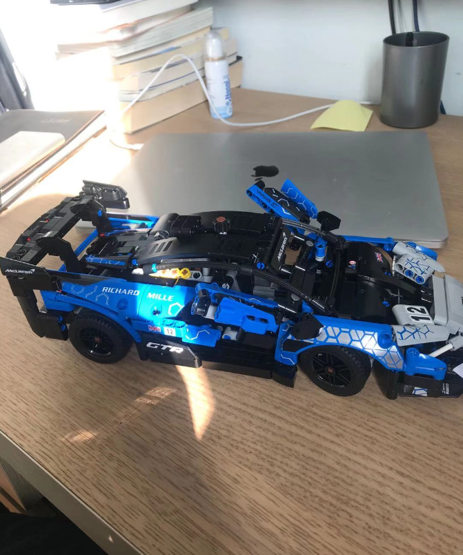
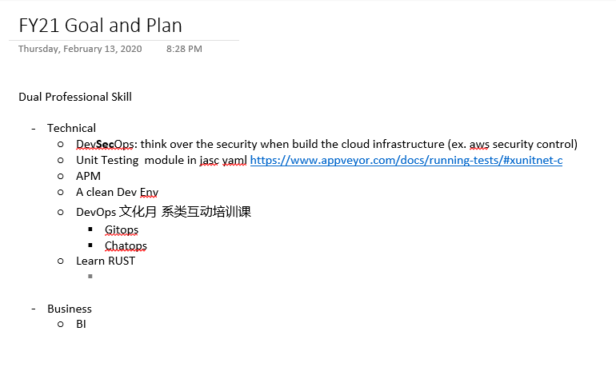
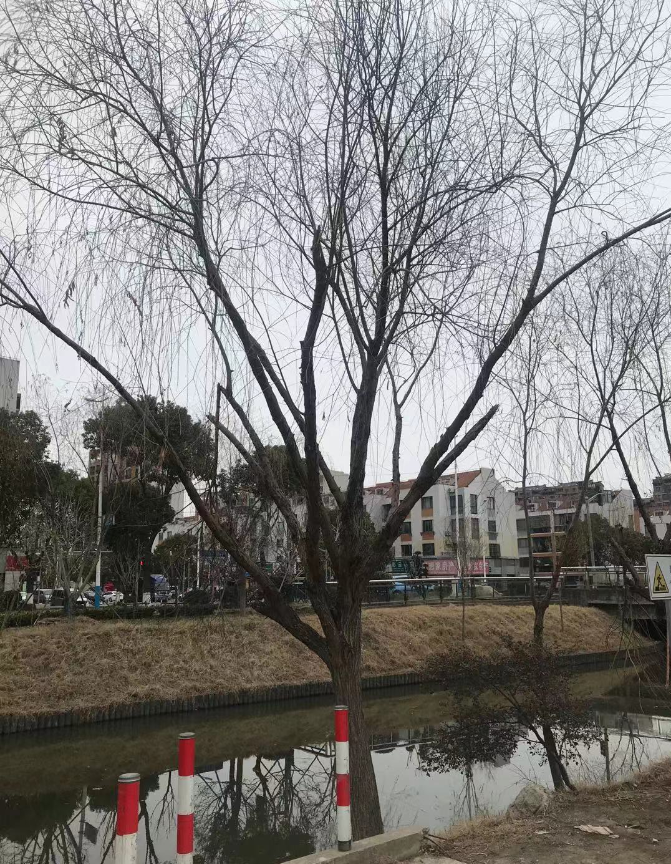

# Growth Mindset 2021

微信公众号“对刘谈心”记录一个"观念改造"的系列。计划是每个月一篇，月底刊登。

观念改造记录这个月我看过的书或网页，遇见的人或事情对我个人的观念的改造，至少当下我比较认同的观念，朋友们一看，能够遇到某一条您也比较接受或认同的，我便心满意足。

<! --more-- >

{:height="50%" width="50%"}

Table Of Context:

- [5月](#2020-05)

- [4月](#2020-04)    [3月](#2020-03)    [2月](#2020-02)

## 2020-02

### ADU 阿杜学习法

自创学习法，如有雷同，纯属巧合。

- 每天学习点新东西 Add
- 每天更新点东西 （ 温故知新或吐故纳新） Update
- 每天删除点无用之物  Delete

### 拿得起，放得下

放弃并不一定是令人沮丧的事情，死撑反而熬人。

### 人生与时间

如果把时间或者是时空比作是PB级存储硬盘（SSD），
我们的人生就像是动态易失的内存（DDRM）。
极少数幸运的人偶尔会往数据库（DB）里插上几条记录。

人生到处知何似，应似飞鸿踏雪泥。

泥上偶然留指爪，鸿飞那复计东西。

### 人生总有无奈

这个春节，因为疫情，鼓励就地过年，我们也决定在上海的家里过年。

就在农历的二十九，外婆过世了，最终我没有回去。

也许是因为不想排队做核酸检查；也许是不想赶着年底还在舟车劳顿；也许是担心各地年后的防疫要求有变化；
也许还有许多其他的原因与理由。

然则，死生为大，送长辈最后一程，这样的传统道德，在现实面前，在钢筋水泥的城市里面，被我无情地抛弃了。

我感到很无力，回去一趟也许不难，难的是遵从内心的选择。而最无奈的是，我内心最终的选择竟然是留在原地。

不近人情也好，不肖子孙也罢，惟愿外婆安息，一路走好。

### 孩童般的专注

春节期间，虽然困在上海，总要带孩子出去走走。年初五去世纪公园赏梅，顺道嘉里城里的乐高玩具店给孩子买了新年礼物。

晚上一回到家，孩子就蠢蠢欲动，拆包装盒准备开始组装搭建，因为太晚了，被我叫停了，让他第二天再搭建。

第二天，早上大人们一起床，他也跟着自己穿好衣服起床了，早饭后就开始沉浸在好几包零件当中，一直到中午1点多钟，兴致勃勃的拿着组装好的成品到我这里展示，然后他才意识到连续几个小时的低头导致的脖子酸。

花了半天时间，弄得脖子酸痛，但是真真实实把一堆散落得零件变成了成品。

反观我这个成年人，10天的假期，混混沌沌想了一些工作上的事情，定了不少目标，可是究竟会有多少会在这一年实现呢？

过去一年的我，精力分散在各个方向，就像下面的这棵柳树，分了很多枝叉，想从各个方向去获取阳光雨露来生长，可是这样的树木虽然可以很丰富，很妖娆，但是他的主树干是长不高的。

希望新的一年里，能学学孩童般的专注。