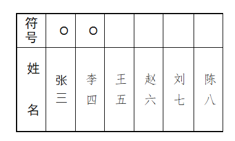

# 从一次选举中看规则设计的重要性

## 差额选举规则说明

### 1. 选举方式
本次选举实行**差额选举**。
*   **候选人总数**：6 名
*   **应选名额**：5 名
*   **差额人数**：1 名

### 2. 有效票判定标准
*   **有效票**：每张选票所选人数（含“赞成”票与“另选他人”）**等于或少于 5 名**。
*   **无效票（废票）**：每张选票所选人数**超过 5 名**。

### 3. 填写符号规范
请在候选人姓名上方的空格内按规定符号填写：

| 投票意向 | 操作说明 | 符号示例 |
| :--- | :--- | :---: |
| **赞成** | 在候选人姓名上方的空格内画圆圈 | **○** |
| **反对** | 在候选人姓名上方的空格内画叉号 | **×** |
| **弃权** | 在候选人姓名上方的空格内**不画任何符号** | (空白) |

### 关于“另选他人”
如果您反对某位候选人并希望另选他人，请按以下步骤操作：
1.  在选票指定的 **“另选人”** 栏内填写您希望选举的人的姓名。
2.  在该姓名的上方空格内画 **“○”**。
> **注意**：“另选他人”也计入总票数，需确保总赞成人数（候选人 + 另选人）不超过 5 人，否则选票无效。

### 4. 注意事项
*   **符号清晰**：请务必保证所画符号清晰、准确，易于辨认。
*   **严禁涂改**：选票不得随意涂改。若涂改导致字迹不清或无法辨认，该选票可能被视为**无效票**。
*   **规范填写**：请严格按照上述要求填写，未按要求操作的选票可能被认定为废票。

## 通俗理解

### 投票操作指南（6选5）

- 怎么选？ 您最多可以投 5 个人的赞成票。
- 怎么画？
  - ✅ 同意他：在名字上面画个圈 ○
  - ❌ 不同意：在名字上面画个叉 ×
  - ⭕ 弃权：什么都不画，留空即可
- 特别提醒：
  1. 如果您画圈的人数超过5人，这张票就作废了。
  2. 如果您想选名单以外的人，请在“另选人”处写上名字并画圈。
  3. 您可以只选1人、4人或5人，也可以全部反对或全部弃权。

- 投票结果示例：

## 一次真实的选举 “41人，40人投出完全一样的选票”

最近，我经历了一场小型的选举。

现场有41位投票人，需要从6位候选人中选出5位。说实话，这6位候选人里，我真正熟悉的只有2位，剩下的大半脸对我来说都是陌生的。

拿到选票时，我仔细端详了一番。姓名排列看似毫无规律，没有明显的倾向（后来我知道，这是严格按照笔画排序的，一种极致的公平）。

面对陌生的名字，该怎么选？

在那一刻，我没有看到左右交头接耳，也没有左右权衡。一种潜意识的直觉驱使着我：
既然看不出区别，那就顺着顺序，选前五个吧。

我觉得自己填得很“客观”，甚至带着一点“随机”的洒脱。

然而，当计票结果出来的那一刻，我愣住了。

**41人参与投票，最终有40人的选择，和我一模一样。**

全场只有1个人，做出了不同的选择。其余40人，在互不交流、没有串通、没有任何暗示的情况下，竟然齐刷刷地勾选了名单上的前五位。

没有暗箱操作，过程公开透明。但这一结果，却像某种无声的魔法，让我感到深深的震撼。

我自知没有人提前和我打过招呼，选举过程公开公正。可是这个结果让我感到很意外。

为何会出现如此惊人的“沉默共识”？

我问了一下千问，AI 给出一份答案：

选票的设计固然是严谨的，可是作为选民手中掌握的信息对称性很重要。如果信息不对称，那么多数人会遵循“心理捷径”的惯性思维。

按规定，候选人按笔画排序本是为体现公平，杜绝人为干预。但在选民对候选人缺乏深入了解时，这种“绝对中立”的排序反而成了潜意识的“推荐序”。心理学上的“首因效应”让大脑默认：排在前面的或许更资深、更靠谱。于是，“顺手勾前五”成了认知成本最低的决策路径。

