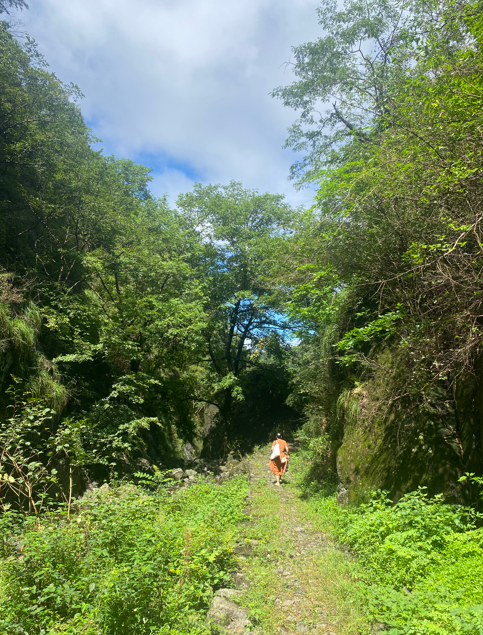
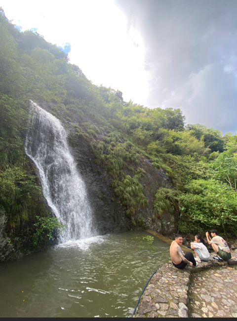

# 浙江徒步之雪窦岭古道

## 往有草的地方戳

下山时儿子突然跟我说："你往有草的地方戳。"

我没反应过来。他解释说，石头台阶上长草的地方，底下一定是石头缝——杖尖戳在缝里才稳。

这是他用了一天登山杖，自己一下一下试出来的。

---

上周末我们走的是雪窦岭古道。台阶是那种大块不规则的条石，年代久了，表面被磨得光滑，有些地方还覆着一层湿滑的青苔。

出发前我给他买了根 NatureHike 的登山杖试水——说明书上讲了长度调节和腕带用法，他上山过程中都体会到了。但说明书没告诉你的是：杖尖戳在光滑湿石面上根本站不住。他一开始本能地往石头缝里戳，确实牢固很多，但石头缝窄，走快了根本瞄不准。有一次他戳空了，杖尖从石面上滑过去，整个人趔趄了一下，吓得我在后面喊了一声"慢点！"

后来他自己琢磨出了规律：台阶上凡是长草的地方，底下必定是缝。因为草只能从缝里长出来。

这个道理说出来很简单。但它不是想出来的，是脚走了一整天、杖尖戳了几百下之后，试出来的。

## 水起风生

下山到一处瀑布跟前，突然凉快了好多。

一开始没反应过来为什么，站了几秒才明白：水往下冲，带着风。不是风生水起，是水起风生。

我们在那儿站着不走了。后面上来一个光皮大哥，走近瀑布，愣了一下，然后冲后面喊："快来这儿！这里凉快！"他朋友们呼啦都围了过来，帽子摘了，袖子撸起来，对着水雾吹。站了好几分钟，谁都不想走。

山里走了一天，这几分钟最惬意。

