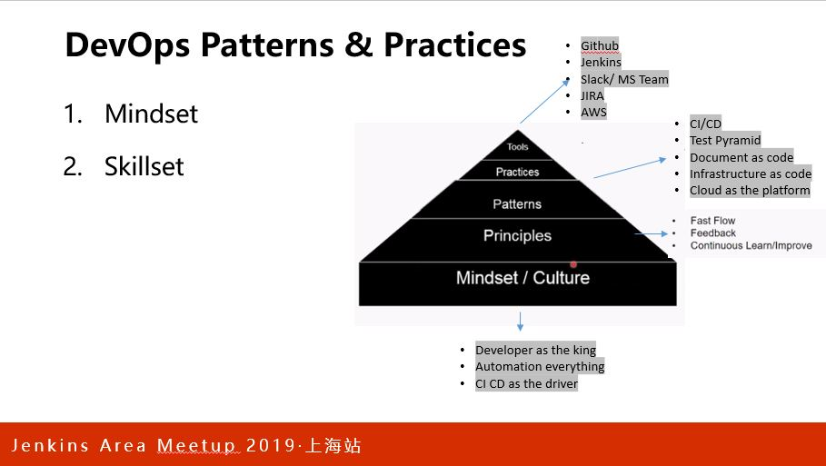

# About me

刘 宁  

More than ten years experience on software industry.

Now works at DXC Technology for the Digital Transformation.

GitHub Page: https://liuning0820.github.io/

----

## Mindset: Everything As Code



----

## Practice: Infrastructure as Code

- Pipeline & Jenkinsfile
- Generate cloud environment using terraform script
- Remote tfstate in AWS S3
- Parameters in AWS SSM
- Pipeline 最大的作用是对劳动力的解放，程序来控制代码从版本库到线上的行进流程，而非人。

----

## Practice: Doc as Code

### What is Docs as Code

Documentation as Code (*Docs as Code*) refers to a philosophy that you should be writing documentation with the same tools as code

- ReadMe and User Guide

Docs as Code approach gives benefits:

- Writers integrate better with development teams (Collaborate !!!)
- The doc cross platform
- Github Page template can be shared across the org & company, make the theme and style consistent, easy to use.
- Developers will often write a first draft of documentation
- You can block merging of new features if they don’t include documentation, which incentivize developers to write about features while they are fresh

----

### How Doc as Code

- Code Instructions ( ex. Readme.md)
- GitHub Page (ex. static site , Jekyll light blog)
- Presentations (reveal.js PPT online)
- [Diagrams as code](https://www.draw.io/)
- Using Jenkins pipeline of mdspell, HTML Proofer to build feedback loop to improve the doc.

----

# Markdown support

Write content using inline or external Markdown.
Instructions and more info available in the [here](https://github.com/hakimel/reveal.js#markdown).

```
<section data-markdown>
    ## Markdown support

    Write content using inline or external Markdown.
    Instructions and more info available in the [here](https://github.com/hakimel/reveal.js#markdown).
</section>
```

----