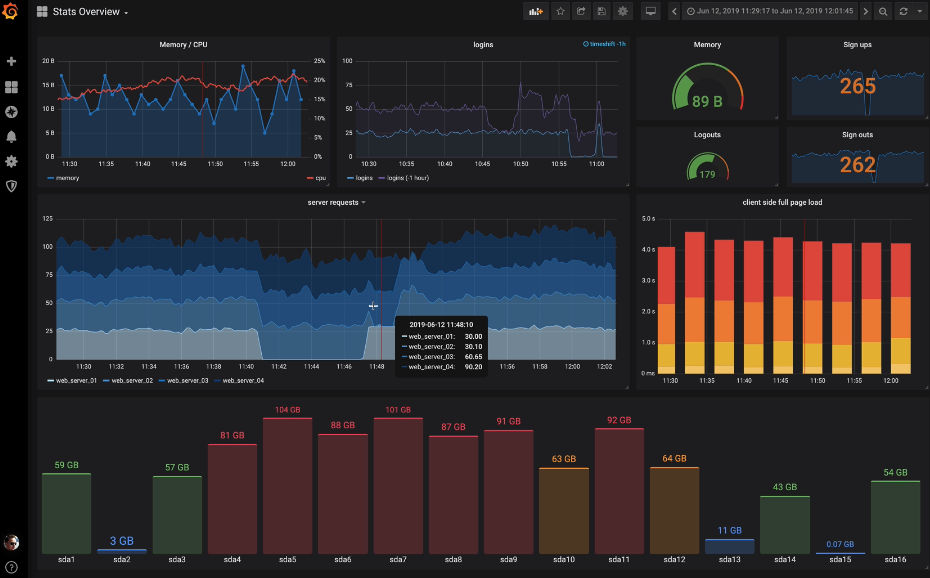
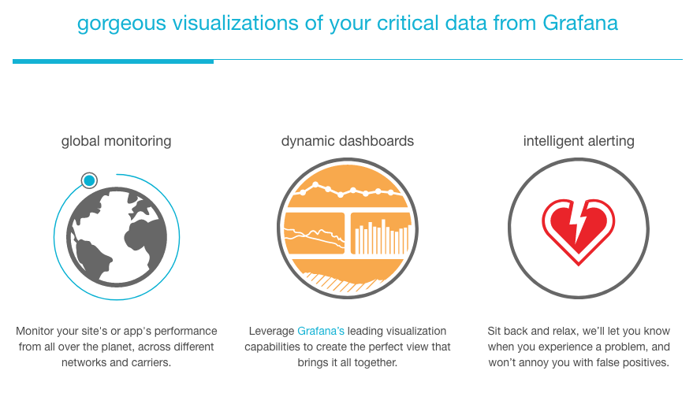
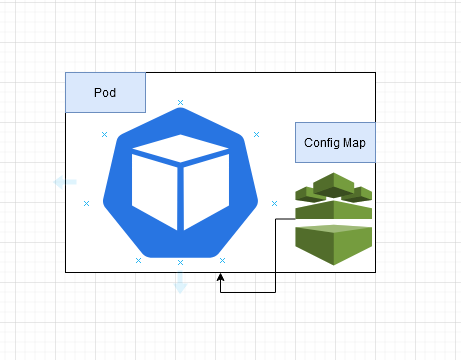
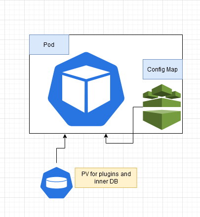
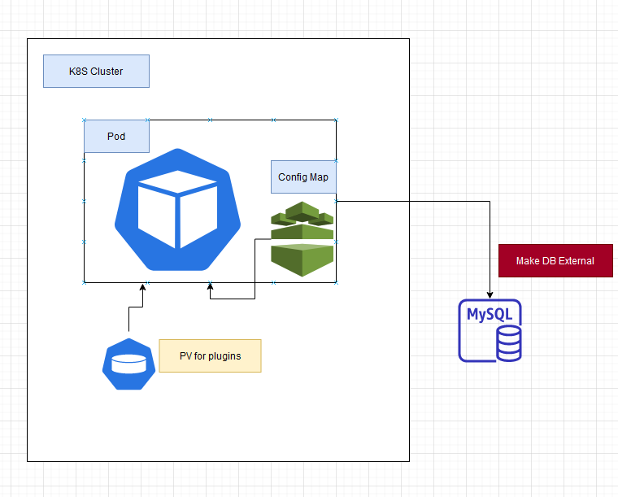

# About Me

Toby Liu

Sr. DevOps Engineer @Tesla

GitHub Page: <https://liuning0820.github.io/>

----

## Grafana As Code

<!-- {:height="80%" width="50%"} -->


----

## Why Grafana

Platform for Observability through Metrics (ex. Promethues), Logs (ex. Splunk), And Trace (ex.OpenTemlemetry)

----

## Dashboard

Virtualazation and Monitoring

- Dispaly Data
- Trend History
- Monitoring

----

## How to design dashboard

- Focus on your users, different users have different goals
- See big picture, focus on specific item need attention and action to be taken

----

## Alert Rules and Notification

----

## Data Source

### TSDB (time-series database)

The time-series database can be used to analyze the past，monitor now，predict the future.

### Relational Database

- mysql, sqlserver

### AWS CloudWatch

### Mixed Data Source

----

## Plugins

- Trust Plugins and Non-Signed Plugins
- Plugins Type
  - Data Source
  - App
  - Panel

----

### WorldPing

[WorldPing](https://worldping.raintank.io/) network performance monitoring and endpoint health check.

```
grafana-cli plugins install raintank-worldping-app
```



----

### FlowCharting

[Flowcharting](https://play.grafana.org/d/Kcic5xeWz/flowcharting-events-and-animations?orgId=1) is a panel plugin. Use it to display complexe diagrams using the online graphing library draw.io.

```
grafana-cli plugins install agenty-flowcharting-panel
```

----

## Provisioning as Code

- [Data Persistent Strategies](#data-persistent-strategies)
- [CI/CD Pipeline](#ci/cd-pipeline)

----

### Data Persistent Strategies

- [Config Map](#config-map)
- [Persistent Volumn](#PV)
- [External DB](#external-db)

----

#### Config Map



----

#### PV

Phase 2 - Using PV for host plugins and internal db



-----

#### External DB

Phase 3 - Split the db out



----


### CI/CD Pipeline

devops:monitoring instance intro and how to contribute

- manage the config as code, nothing lost, no duplicate work
- easy to boot a new instance
- easy to upgrde

----

## User Management

- Org
- Team
- User

----

## Demo

- demo dashboard playlist
- demo edit flowchart
- demo ci/cd to provisoning a dashboard
- demo worldPing to do EndPoint check

----

## Reference

- [Play grafana](https://play.grafana.org)