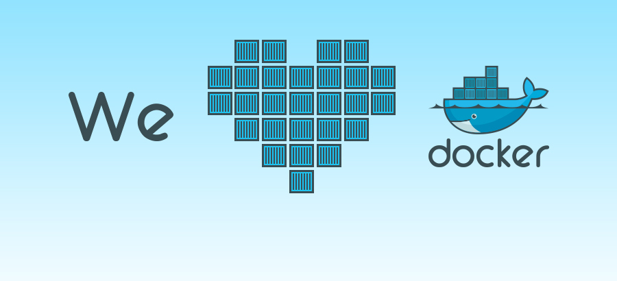
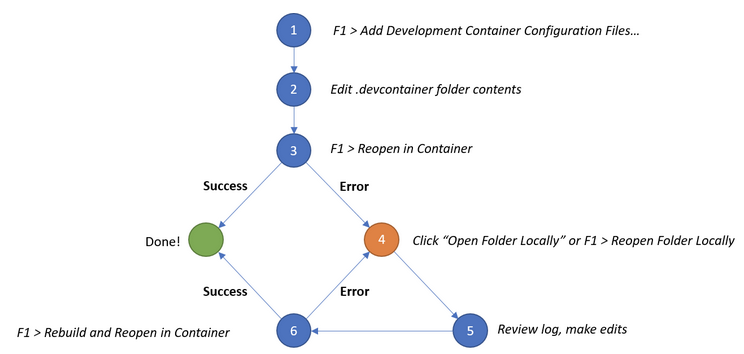

# About Me

Toby Liu

A Software Engineer

GitHub Page: <https://liuning0820.github.io/>

----


## 房子的故事
<!-- 
古代，在一个地方造一所房子，然后搬家，要重新造一所房子

现代，卖掉一个地方的房子，到另外一个地方重新买一所房子 （不怎么有钱的人）
现代，有钱人，到另外一个地方重新买一所房子 （有钱人）

但是最洒脱的是

移动工房 Docker -->

Container

----


## What Does Clean Mean

- Use Cross Platform Software
<!-- 能够在任何平台或云中统一、一致地运行 -->

- Portability (BYOD)
<!-- 容器可以轻松地从台式计算机传输到虚拟机器 （VM） 或从 Linux 传输到 Windows 操作系统，并且它们将在虚拟化基础架构或传统"裸金属"服务器上持续运行，无论是在本地还是在云中 -->

- Keep Your OS Clean

- **Isolation** With [Containerization](https://www.ibm.com/cloud/learn/containerization)
<!-- isolation: fault isolation, more secure -->




----

## A Clean Work Environment


- Visual Studio Code with Remote Development Extension
- Docker Desktop
- (Optonal) git && kubectl for Social Dev
<!-- - telepresence <https://cloud.google.com/community/tutorials/developing-services-with-k8s> -->

<!-- {:height="80%" width="50%"} -->

<!--  -->

<!-- {:height="20%" width="20%"} -->


----

## Clean Development in Container

<!--  -->


----

## Lab Time

```sh

git clone https://github.com/liuning0820/liuning0820.github.io.git && code

# For MacOS
CMD+SHIFT+P ">Remote-Container: Open Folder in Container"

# For Windows
CTRL+SHIFT+P ">Remote-Container: Open Folder in Container"


```

----

## Reference

https://www.theurlist.com/clean-dev

https://github.com/microsoft/vscode-dev-containers/

----

