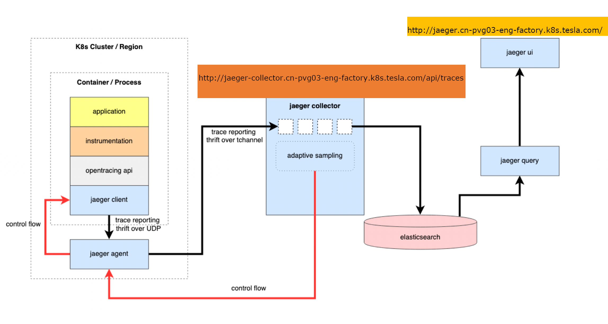

# About Me

Toby Liu

Sr. DevOps Engineer

GitHub Page: <https://liuning0820.github.io/>

----

## A Clean Dev Environment

- git
- Visual Studio Code
- Docker
- kubectl
- telepresence <https://cloud.google.com/community/tutorials/developing-services-with-k8s>

<!-- {:height="80%" width="50%"} -->

<!--  -->

----

## Reference

https://www.theurlist.com/clean-dev

----

